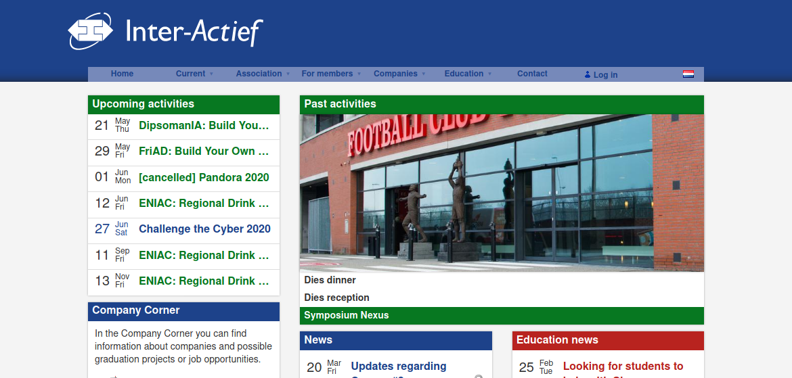

# Amélie
Le fabuleux destin d'Amélie.

GitLab build main: 

GitLab build production: 

Amélie is the website and member administration system of I.C.T.S.V. Inter-*Actief*, built with Django.

## Issues, Feature Requests
Issues and features can be reported and requested on [Inter-Actief/amelie](https://github.com/Inter-Actief/amelie/issues).

## Contributing
Please see [CONTRIBUTING.md](./CONTRIBUTING.md)

## License
Amélie is distributed under the BSD 3 clause license.
Please see [LICENSE.md](./LICENSE.md) for details.

## Contact
For direct contact with the main developers, please send an e-mail to [www@inter-actief.net](mailto:www@inter-actief.net).
